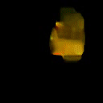
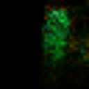

## Executing Code For Training
- Check .config in the /configs folder if it is set correctly, especially the dataset path which is relative to the /trainers directory
- Check the shell file in the /scripts folder if it is correct and if the path to the correct config file is properly set
- Execute the shell file in the /scripts folder
- Logging will get saved in the /scripts folder at this time

## Executing Code For Inference
- Check .config file in the corresponding folder to have the right path. IMPORTANT: Set a load path with a checkpoint file
- Check the shell file for evaluation if set properly
- Execute the shell file to run the inference
- Resulting predictions will be in an h5 file within the scripts folder

## Evaluation
To evaluate training or predictions use the corresponding evaluation.py file

## IMPORTANT FILES
For loading a Dataset the /dataloaders/MultimodalManipulationDataset.py file is responsible
The get_single() method is mostly used to load the data directly from the dataset

The /trainers/selfsupervised.py file is the main part of the network. It holds the training loop, the validation loo, the loss calculation and the dataset initialization.

The networks are in the /models folder. Here, the sensor_fusion.py file holds the encoding for the final modality vector while the /base_models holds the encoder.py and the decoder.py to encode the different modalities or decode different values from the final vector again.

## Resulting gifs for the optical flow
Ground truth and prediction Optical flow

